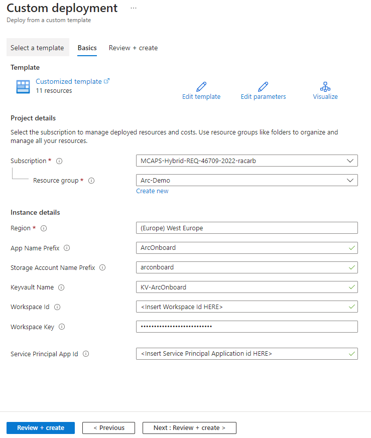
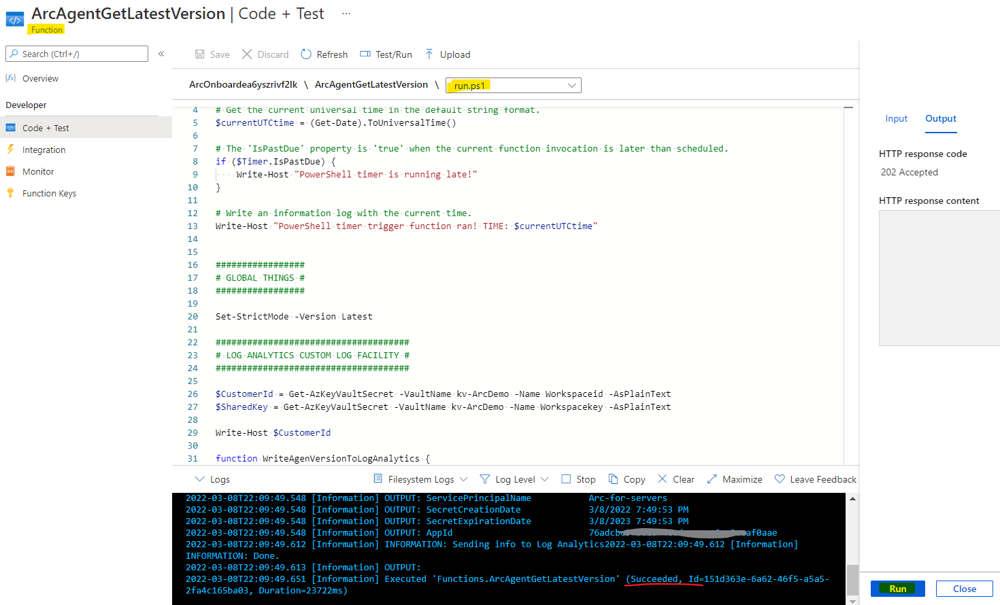

##  Azure Function ARM Template

This Azure Function is used for the following:

-  It checks for the latest Azure Arc Agent version in https://docs.microsoft.com/en-us/azure/azure-arc/servers/agent-release-notes and shows the latest agent release notes in a workbook
-  It gets information from the Service Principal used to onboard machines in Arc, such as *name*,*creation date* and *expiration date*. This information is shown in the workbook

**Prerequisites:**

An Azure Keyvault that contains 2 Secrets with the following information:

-   *Workspaceid*: Id of the Log Analytics Workspace to store the information about Azure Arc Versions and Service Principal.
-   *WorkSpacekey*: Key to post data to the Workspace

   

**Installation:**

-   Deploy *AzureFunctionAgentVersion.json* ARM Template to the desired Resource Group

   
-   Modify the Key Vault Access policies to allow the Azure Function to access the secrets in the key vault. Use the system managed identity of the function to assign permissions

   

- Assign the system managed identity of the function the *Directory readers* Azure Active Directory roles, or any equivalent role than can read Applications from AAD

   

-   Inside the Function App, modify the *requirements.psd1*, delete the line with Az Powershell version and use the following lines instead:
   
         'Az.KeyVault' = '4.*'
         'Az.Resources' = '5.*'

 This will enable the function to use these PowerShell modules.

   

- Restart your Azure Function. The load of PowerShell az module might take some minutes

- Run the Function and check that the Log Analytics log has been populated.
  

