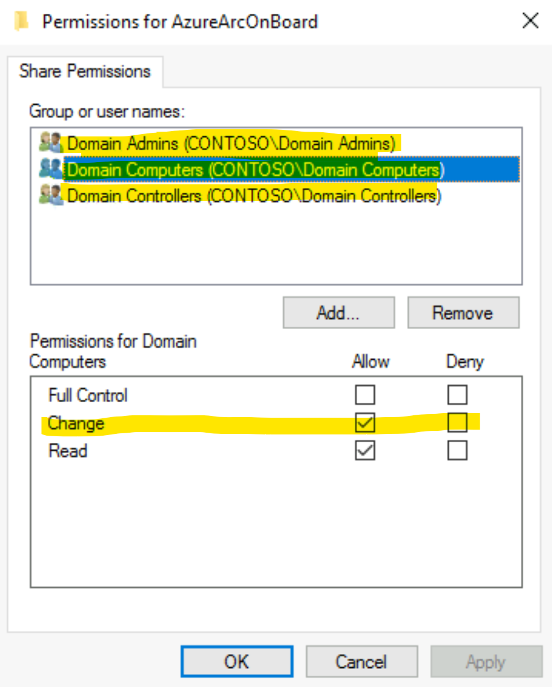
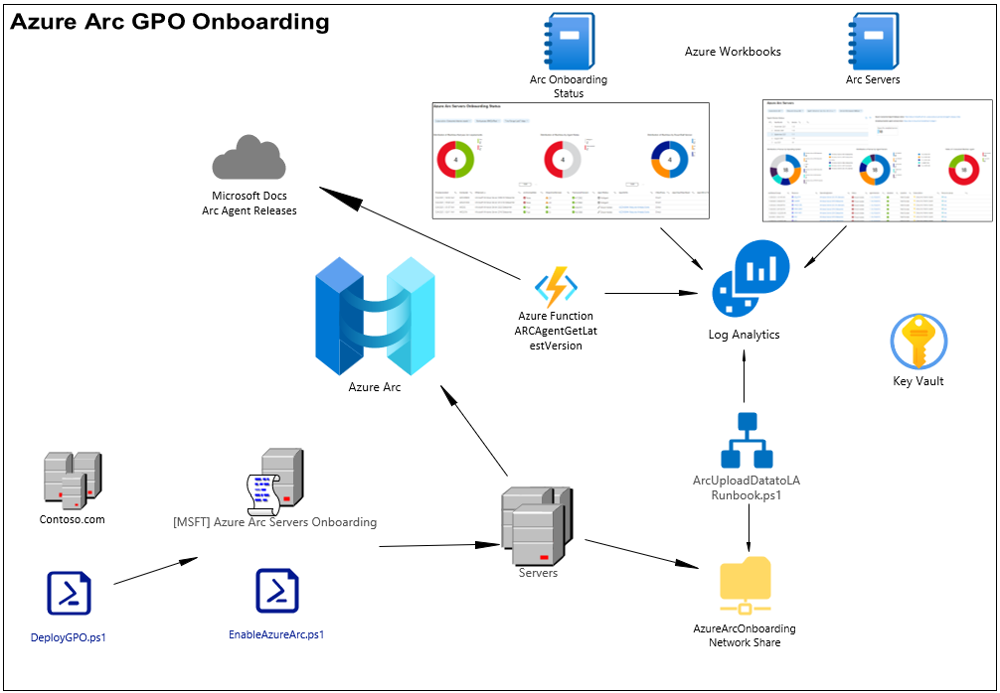
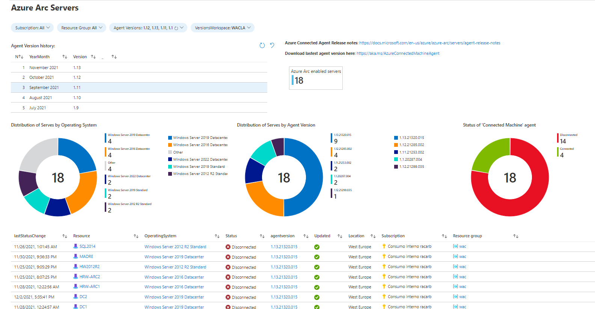
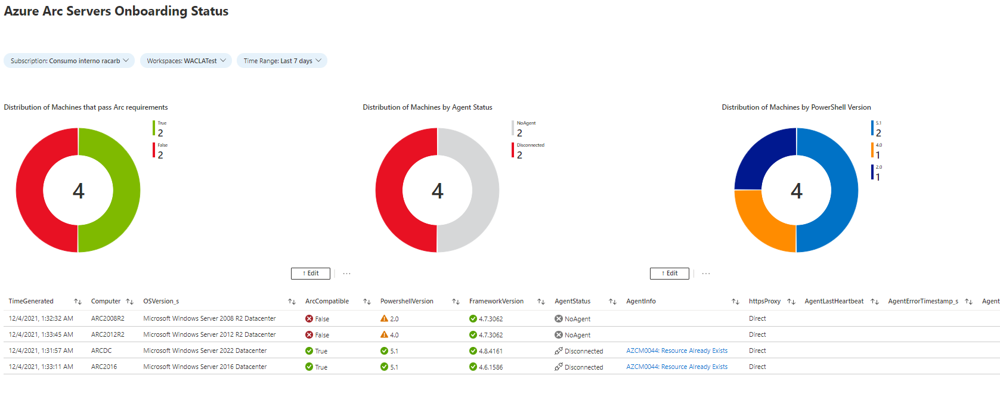
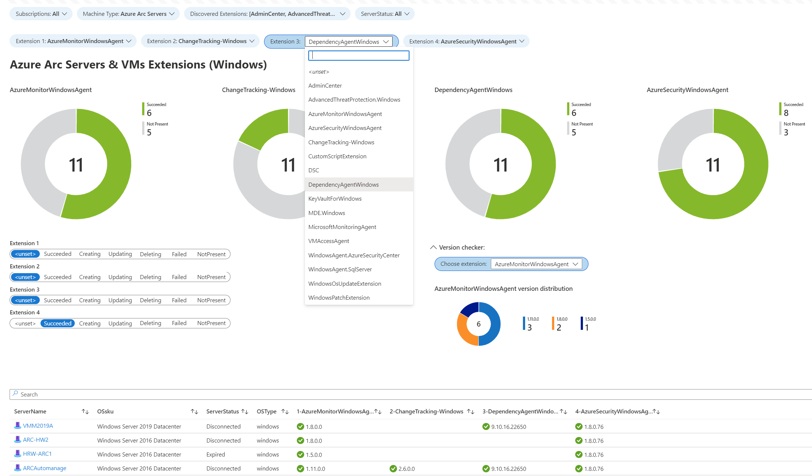
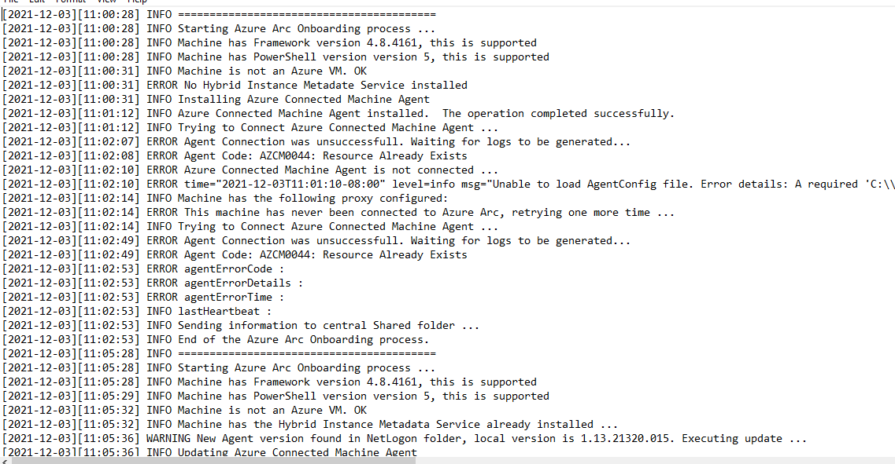

# Arc Deployment by GPO
Arc GPO Deployment project contains the necessary files to onboard Non Azure machines to Azure Arc automatically, using a GPO

The project also contains Azure Workbooks to keep track of the onboarding process.

## Content

- [DeployGPO.ps1](DeployGPO.ps1): PowerShell script to deploy the GPO in a certain AD domain
- [EnableAzureArc.ps1](EnableAzureArc.ps1): PowerShell script that has to be placed in the network share and will execute the onboarding process.
- [RenewSPSecretDPAPI.ps1](RenewSPSecretDPAPI.ps1): PowerShell script to renew the secret from the Service Principal used for the onboard of Azure Arc Servers.
- [ParseArcOnboardingPrerequisites.ps1](ParseArcOnboardingPrerequisites.ps1): PowerShell scripts that parses the information of the machines that didn't meet the onboard requirements.
- [ArcGPO](ArcGPO): Folder structure that contains the GPO settings to be imported in AD
- [ARMTemplates](ARMTemplates): Folder with Azure Function Template to monitor Azure Arc Agent version updates.
- [Workbooks](Workbooks): Folder with Azure Workbooks to monitor your Azure Arc onboarding Status and your Azure Arc Servers
- [ScheduledTask](ScheduledTask): Folder with a scheduled task that can, programmatically, upload on-prem XMLs report files to Azure Log Analytics

## Prerequisites

- Create a *Service Principal* and give it Azure Arc onbarding permissions, following this article: [Create a Service Principal for onboarding at scale](https://docs.microsoft.com/en-us/azure/azure-arc/servers/onboard-service-principal#create-a-service-principal-for-onboarding-at-scale)
  
- Register *Microsoft.HybridCompute*, *Microsoft.GuestConfiguration* and *Microsoft.HybridConnectivity* as resource providers in your subscription, following this article: [Register Resource Provider](https://docs.microsoft.com/en-us/azure/azure-resource-manager/management/resource-providers-and-types#register-resource-provider)

- Create a *Network Share*,e.g. *AzureArcOnboard* that will be used for deployment and reporting files, with the following permissions:

  *Domain Controllers*, *Domain Computers* and *Domain Admins*: Change Permissions

 
 

## Installation

### Group Policy Deployment

- Copy the project structure to a local folder of a Domain Controller.

- Copy the *'AzureConnectedMachineAgent.msi'* file to the *ArcRemoteShare*. 
    You can download it from https://aka.ms/AzureConnectedMachineAgent

- Modify *EnableAzureArc.ps1* onboarding file, to customize Azure tags for onboarded servers

      $tags = @{ # Tags to be added to the Arc servers
          Department  = "Department"
          deployedBY  = "GPO"
          Responsible = "Responsible"
      }

- Execute the deployment script *DeployGPO.ps1*, with the following syntax:
  
      .\DeployGPO.ps1 -DomainFQDN contoso.com -ReportServerFQDN Server.contoso.com -ArcRemoteShare AzureArcOnBoard -ServicePrincipalSecret $ServicePrincipalSecret 
       -ServicePrincipalClientId $ServicePrincipalClientId -SubscriptionId $SubscriptionId -ResourceGroup $ResourceGroup -Location $Location -TenantId $TenantId 
       [-AgentProxy $AgentProxy] [-PrivateLinkScopeId $PrivateLinkScopeId]
    Where:

    - *ServicePrincipalClientId* is the ID from the Service Principal created previously

    - *ServicePrincipalSecret* is the secret from the Service Principal created previously.

    - *ReportServerFQDN* is the Fully Qualified Domain Name of the host where the network share resides.

    - *SubscriptionId* is the subscription ID of your new Arc resources

    - *Location* is the location (like "westus") of your new Arc resources

    - *ResourceGroup* is the resource group containing your new Arc resources

    - *TenantId* is the tenant ID used to onboard new Arc resources

    - *ArcRemoteShare* is the name of the network share you've created

    - *AssessOnly* [optional] makes the GPo to work in Assess mode, no onboarding is done.

### Azure Worbooks Deployment

  -  #### Workbook - Arc Servers

       - Deploy the Azure Function that checks for the Arc Agent Releases, using this guide: [Azure Function Deployment](/ARMTemplates/Readme.md). This function creates the *AzureARCAgentLatestVersion_CL* log in Log Analytics.
  
       - Create a new Workbook and copy the content from this source json file: [ArcServers.json](/WorkBooks/ArcServers.json):

  -  #### Workbook - Arc Onboarding Status

       - Use either of these methods to upload data from XML files to Log Analytics programmatically. This will populate the *ArcOnboardingStatus_CL* log.

            [Scheduled task](/ScheduledTask/ArcUploadDatatoLA.ps1)

            [Azure Runbook](/Runbook/ArcUploadDatatoLA-Runbook.ps1)

       - Create a new Workbook and copy the content from this source json file: [ArcOnboardingStatus.json](/WorkBooks/ArcOnboardingStatus.json):

  -  #### Workbook - Arc Servers & Azure Virtual Machines extensions

       - Deploy the workbook [AzureArcServers&VMsExtensionsMonitor](/WorkBooks//AzureArcServers%26VMsExtensionsMonitor.json), creating a new woorkbook in the portal using the json information as content. Once created, choose up to 4 extensions for Windows & Linux machines, to monitor their status.

## Solution Diagram

This is the full picture of the solution:

## ChangeLog

### 10-Feb-2023
* Added Azure Arc Private Link Support
* New version of workbook [AzureArcServers&VMsExtensionsMonitor](/WorkBooks//AzureArcServers%26VMsExtensionsMonitor.json), now with extension version control and extension dynamic parameters filter

### 14-Oct-2022
* New workbook added in the Workbooks folder [AzureArcServers&VMsExtensionsMonitor](/WorkBooks//AzureArcServers%26VMsExtensionsMonitor.json), to monitor the installation of extensions in Azure Arc & Azure VMs Machines. The workbook must be deployed as an ARM template, selecting the extensions to be monitored. 

### 15-Sep-2022
* Streamlined whole process by adding parameters to Deploy script instead of Enable script

### 2-Jun-2022

* Changed Encryption method to DPAPI. No keys are stored in target servers
* New PowerShell Script *RenewSPSecretDPAPI.ps1* to renew Service Principal Secret.

### 12-Apr-2022

* Added script *RenewSPSecret.ps1*, to renew the secret from the *Service Principal* used to onboard servers

### 11-Mar-2022

* Moved deployment files from *Netlogon* folder to a generic shared folder
* Added *Service Principal* monitoring to the Azure Arc Servers main Workbook
* Minor changes: Updated Help and workbooks filters

### 18-Jan-2022

* Added *-AssessOnly* switch parameter to make the GPO work in Assess mode (without onboarding machines) 

### 15-Dic-2021

* FIXES: Automatic update of local agents improved. Added new pre-task to clean the remaining scheduled task that sometimes remained active.
  

### 13-Dec-2021

* Added Active Directory Site information to Azure Arc Servers Tags, as follows: Site:ADSiteName

### 09-Dec-2021

* New Azure Workbooks to monitor your Azure Arc onboarding Status and your Azure Arc Servers
* New Azure Function to track Azure Arc Agent new version releases
* A Scheduled Task was created to programmatically upload all XMLs files to the Log Analytics Workspace.

### 03-Dec-2021

* Proxy functionality was added to the GPO with a new parameter -AgentProxy

### 02-Dec-2021

* New mandatory parameter *NetlogonSubfolder*.The folder structure is now created automatically and assigned the proper permissions

### 01-Dec-2021

* Removed service principal secret from the netlogon script. Secret is encrypted automatically at runtime and stored in remote registry Key
  
### 30-Nov-2021

* Machines automatically updates their Arc Agent in case there is a new version in the netlogon folder
* No connected machines log connection errors to the 'NotConnected' subfolder
* Improved local logging with Agent Error Code
* Local log maintenance (circular logging)

## Screenshoots:

* **Azure Workbooks** :

  Azure Arc Onboarded Servers

  Azure Arc Onboarding Status

  Extensions Workbook

* **Local loging** :

A process where the machine already exists in ARC and throws an error AZCM0044:

&nbsp;
&nbsp;
&nbsp;

* **Remote Share** :

Permissions needed in shared folder for instalation and reporting purposes

